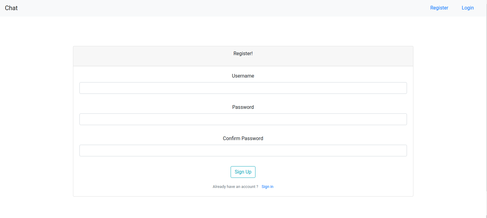
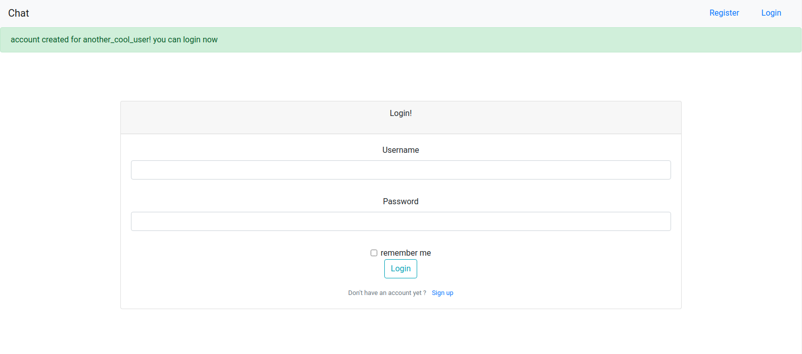
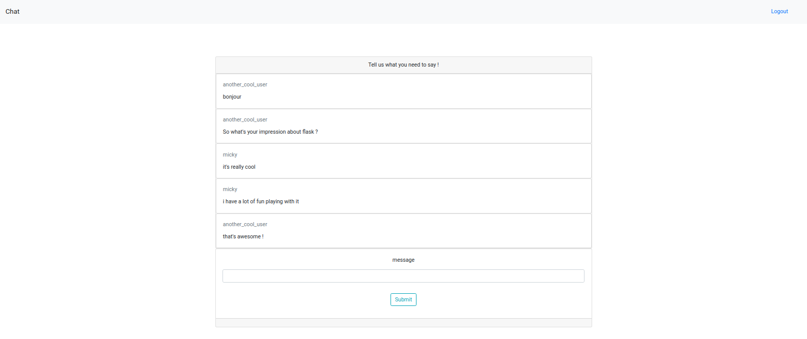
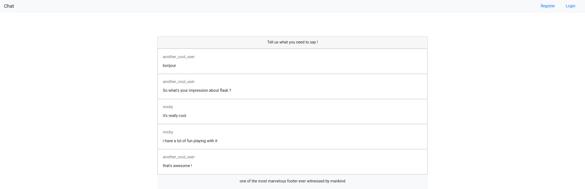
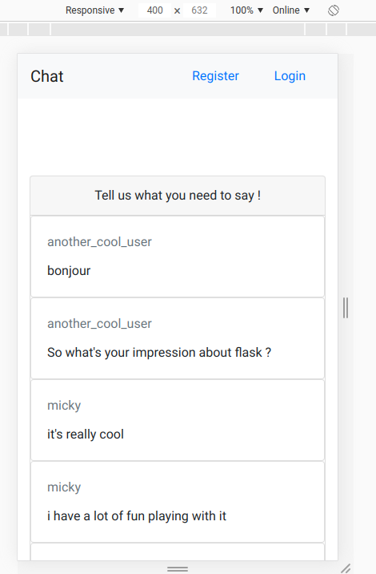

# flask_chat

This is a personal project i made to reinforce my understanding of flask.

it's a simple responsive chat driven by an sqlite database. it contains a user login/registration system (with hashed password) and the fact that you are logged-in or not modify the website's appearance

## technos

- Python (Flask)
- Sqlite
- Html/css (Bootstrap 4)

## what it looks like 

made with heart [__by me__](https://mickycompanie.github.io./)
